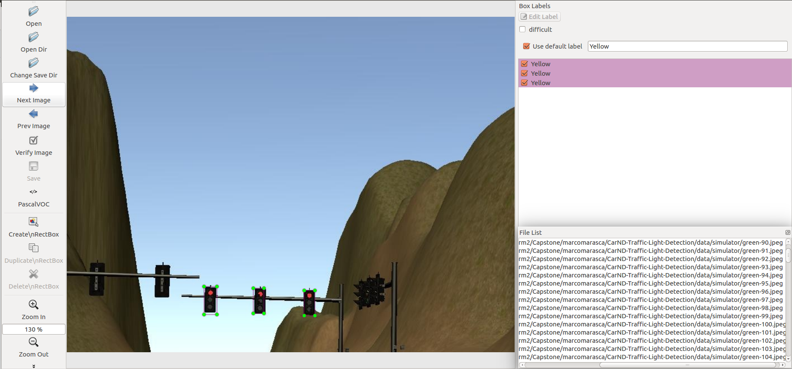
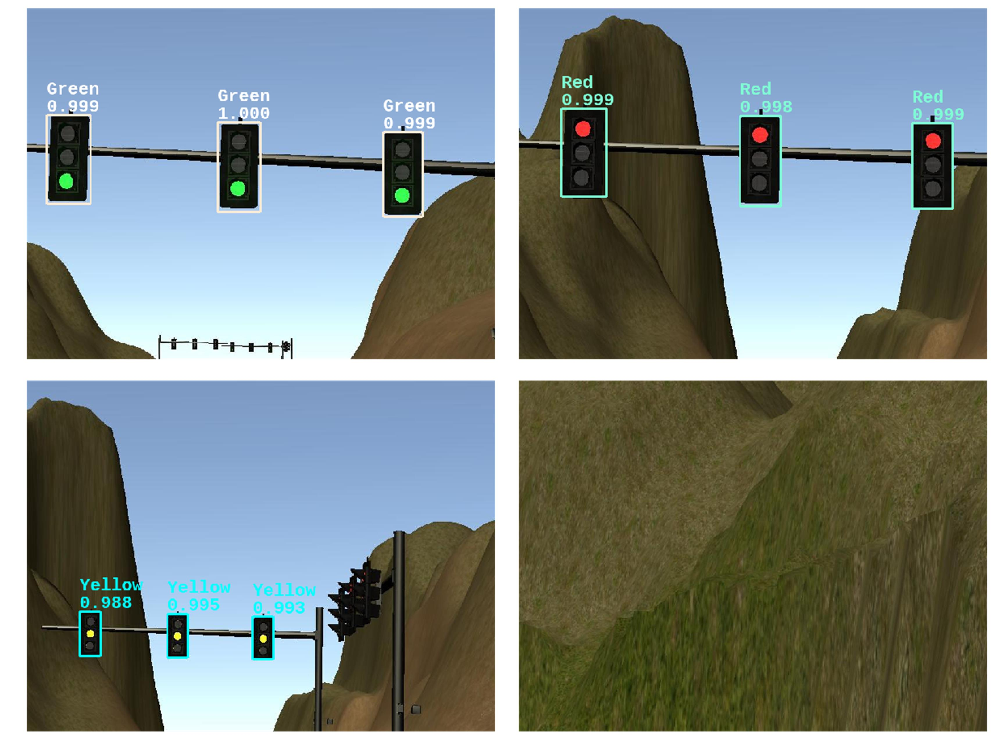
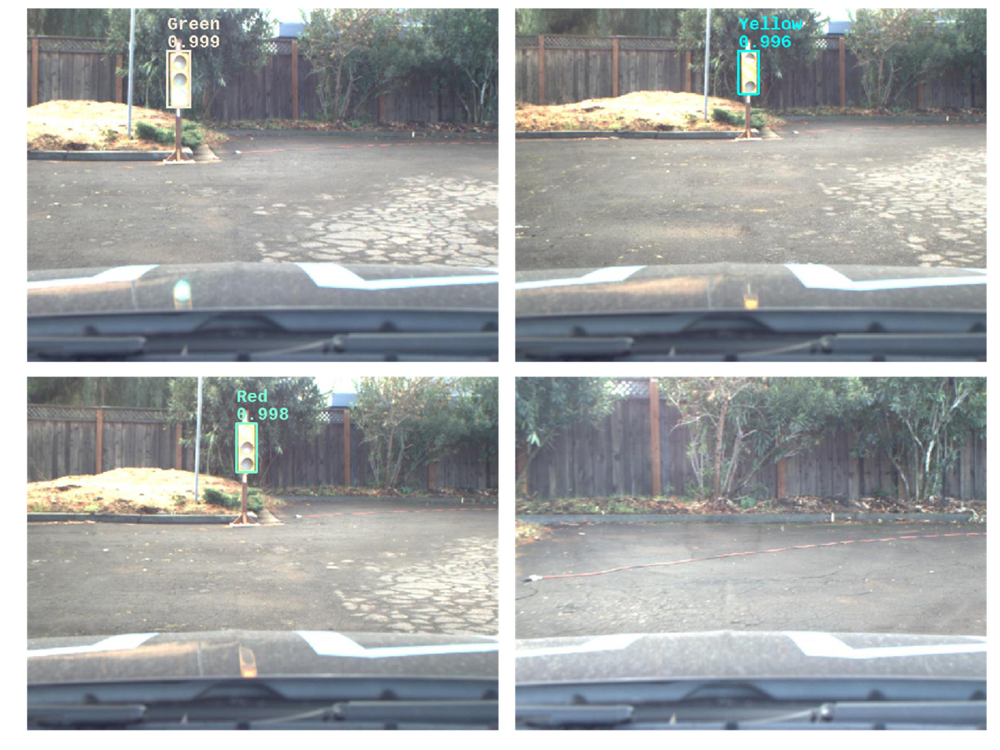

# Self Driving Car - Capstone Project

# Overview

## Team Members

By order of joining the team:
- Ali Safdar Kureishy (Lead)
- Eugene Verichev
- Szilard Bessenyei
- Naveed Usmani
- Mark Melnykowycz

# Installation

# Architecture

# Implementation

## Nodes

### Server/Bridge

### Waypoint Updater

### Waypoint Loader

### Traffic Light Classifier

#### Data sets

The dataset was downloaded from [here](dataset_link). Beside that dataset, we labeled images manually with labelImg.

We had three classes: 1 - Green, 2 - Yellow, 3 - Red.

#### Training the model
We chose the transfer learning technique to solve traffic light classification. We fine-tuned the ssd_mobilenet_v2 model from the Tensorflow model zoo. We made the following significant changes:
1. We decreased the last fully connected layer from 90 to 3 nodes.
2. Increased the box predictor size from 1 to 3.
3. We enabled depth wise convolution.
4. We reduced the training process steps from 200k to 20k.
5.  We changed the paths for tune checkpoint, input, and label map path.

The model was trained on Google Cloud ML and locally as well with the following configuration:

|Batch Size |Steps |Learning Rate |Anchors Min Scale |Anchors Max Scale |Anchors Aspect Ratio |
|---	    |---   |---	          |---	             |---	            |---                  |
|24         |20000 |0.004         |0.1               |0.5               |0.33                 |

The used scripts for traning are located in [utils folder]

####Evalation:

*Results for Udacity sumlation*

*Results for training bag*

### DBW / Twist Controller

# Results

## Simulation Mode

## Site Mode

# Limitations

# Future Enhancements
